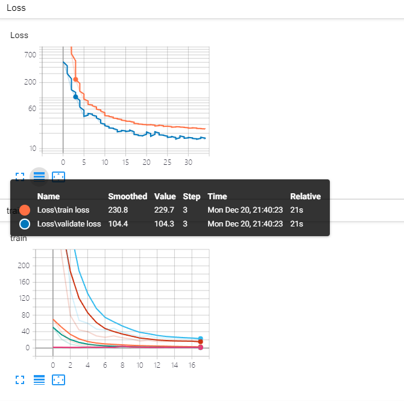

# MDL
A pytorch version implement of paper [Flow Prediction in Spatio-Temporal Networks Based on Multitask Deep Learning](http://urban-computing.com/pdf/TKDE2019ZhangZheng.pdf)

## Package
torch==1.7.1+cu110  
tensorboardX==2.1  
numpy==1.16.6  
sklearn==0.23.2  

## Dataset
[NYC Taxi](https://www1.nyc.gov/site/tlc/about/tlc-trip-record-data.page)  
Test on January of 2015 yellow taxi data, the dataset shape is  
```python
od image : (744, 512, 16, 16)
in_out image : (744, 2, 16, 16)
```
test result
```python
{
    "flow_rmse": 15.852508544921875,  
    "flow_mae": 10.48455810546875,  
    "flow_mape": 1.1115001440048218,  
    "od_flow_rmse": 1.3503321409225464,  
    "od_flow_mae": 1.083322525024414,  
    "od_flow_mape": 120486744.0  
}
```
convergency curve
